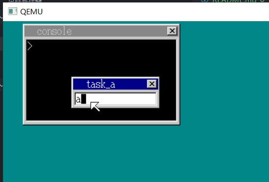

# Homebrew Operating System

> *本代码主要参考教程《30天自制操作系统》（川合秀实） 编写实现*
>
> *另外，根据个人理解对书中代码的实现做了一些修改，如书中使用数组实现定时器和线程等，本代码中将其改为了*

## 准备工作

1、windows下基于C语言实现；

2、代码使用./tools下的编译工具编译，同时该工具也提供了一个仿真环境；

## 代码运行

1、将 ./tools 下的压缩包解压到本地，将整个代码放到 tolset 文件夹下；

2、双击!cons.bat打开命令窗口；

3、输入 `make run` 即可，会显示如下界面；

## 目前进展

本项目还未完成，目前完成到书中第20天的进度

目前已实现以下功能
- 任务调度
- 文字输入窗口：可输入26个英文字母和其他字符
- 命令行窗口：支持dir，type，cls，mem几个命令

